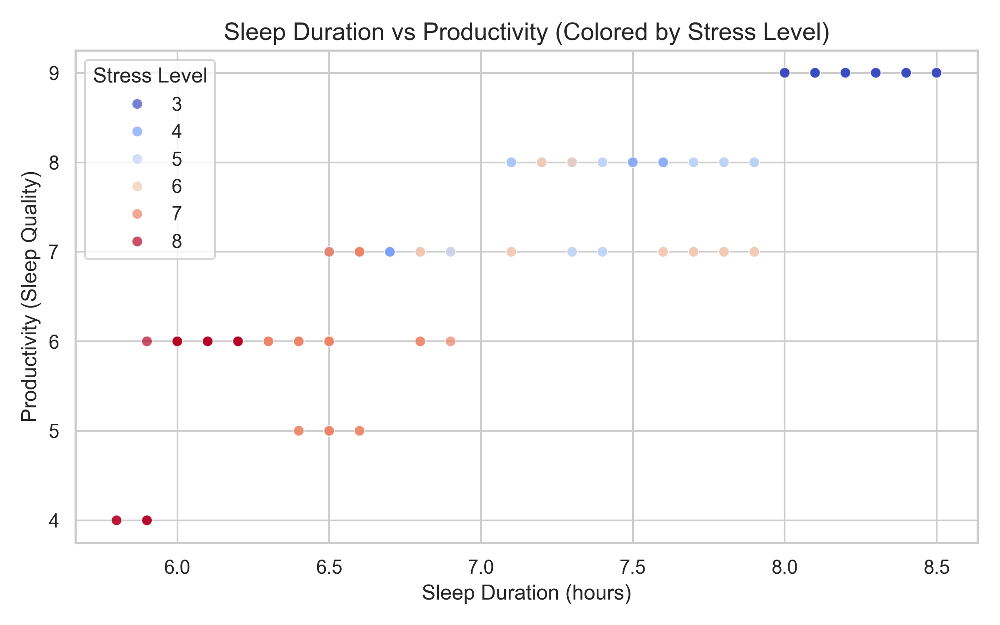
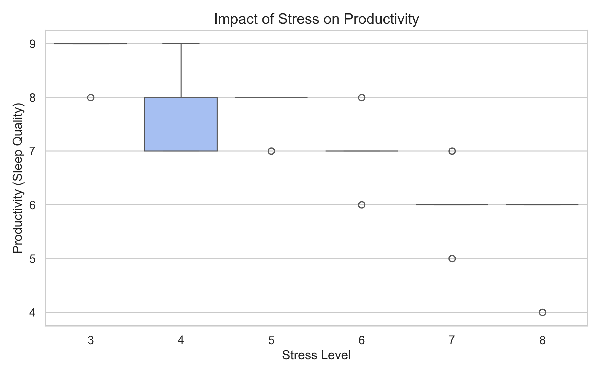
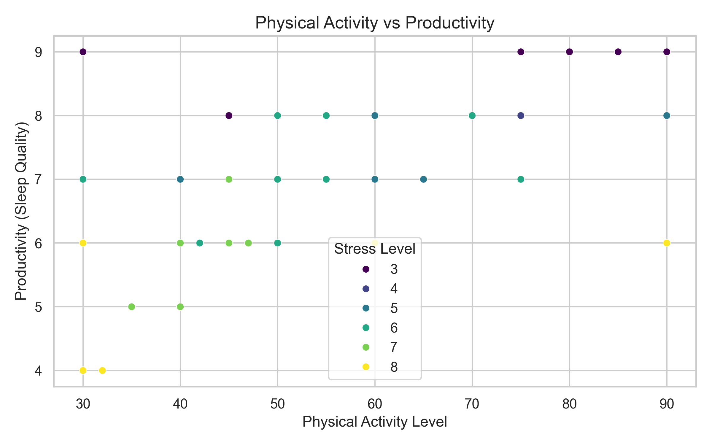
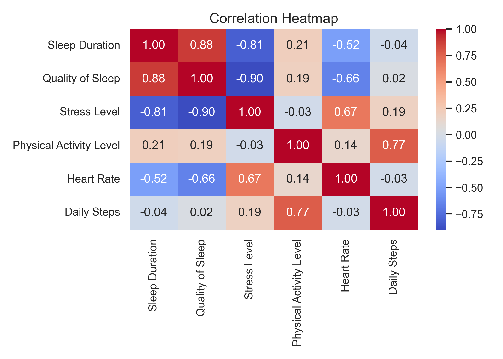

# Introduction

> Better sleep is often treated as the simple answer to low productivity.  
> But the data suggests a more complicated story.

For many students and professionals, low productivity is often explained in a simple way: “I did not sleep enough.” This idea is reasonable because sleep is closely related to attention, memory, and daily energy. However, real life is rarely shaped by one factor alone.

Some people sleep for enough hours but still feel tired. Others sleep less but remain highly productive. This suggests that sleep duration may not be the full explanation. Stress, physical activity, and other lifestyle factors may change how sleep affects daily performance.

This project uses a sleep health and lifestyle dataset to explore one central question:

**Is sleep really the key, or does stress change the story?**

# Dataset Overview

The dataset contains individual-level information about sleep habits, lifestyle factors, and basic health indicators. It allows us to examine how sleep, stress, and activity patterns are connected.

Key variables include:

- **Sleep Duration**: number of hours slept per night  
- **Quality of Sleep**: used as a proxy for productivity  
- **Stress Level**: self-reported stress level  
- **Physical Activity Level**: daily activity level  
- **BMI Category**: body mass index group  
- **Heart Rate** and **Daily Steps**: additional lifestyle indicators  

In this project, **Quality of Sleep** is used as a proxy for productivity. This is not a perfect measure, but it is a reasonable starting point because better sleep quality is often connected with stronger attention, better energy, and improved daily functioning.

The goal is not to prove that sleep directly causes productivity. Instead, the goal is to explore patterns in the data and understand whether productivity is shaped by sleep alone or by a broader lifestyle context.

# Sleep and Productivity

The first step is to look at the most direct relationship: sleep duration and productivity.



At first glance, the chart suggests a generally positive relationship. People who sleep longer often report better sleep quality, which is used here as a proxy for productivity. This supports the common belief that sleep matters.

However, the pattern is not perfectly smooth. People with similar sleep durations can still have different productivity scores. This means that sleep duration alone cannot fully explain the variation in productivity.

The color differences in the chart also suggest that stress may be important. Some people may sleep enough hours, but if their stress level is high, their productivity may still remain low. This is where the story becomes more interesting.

# Stress and Productivity

After looking at sleep, the next question is whether stress changes the picture.



This visualization shows a clearer negative relationship. Higher stress levels are generally associated with lower productivity.

This finding is important because it challenges the simple idea that “more sleep automatically means better performance.” Sleep may help, but stress can weaken its benefits. A person who sleeps enough but remains under high stress may still struggle with focus, energy, and daily performance.

In other words, stress appears to be more than just a background variable. It may be one of the main factors shaping the sleep-productivity relationship.

# Physical Activity and Productivity

Productivity is also connected to broader lifestyle habits. Physical activity is one example.



The chart suggests that individuals with higher physical activity levels tend to show better productivity outcomes. This does not mean that exercise directly causes higher productivity in this dataset, but it suggests that active lifestyles may be associated with better sleep quality and daily functioning.

This adds another layer to the story. Productivity is not simply about sleeping longer. It is also connected to how people live during the day, including how active they are and how they manage stress.

# Correlation Between Variables

To summarize the relationships among the main numerical variables, the heatmap below shows the correlations between sleep, stress, activity, heart rate, daily steps, and productivity.



The heatmap helps confirm the broader pattern. Stress is negatively related to productivity, while sleep duration and physical activity show more positive relationships.

This supports the main narrative of the project: productivity is not controlled by one single factor. Instead, it is shaped by a combination of sleep, stress, and lifestyle conditions.

# Interactive Exploration

Static charts provide a useful overview, but interactive visualizations allow readers to explore the data more personally.

<iframe src="figures/interactive_plot.html" width="100%" height="600" style="border:none;"></iframe>

In this interactive chart, users can hover over individual points and examine details such as age, occupation, physical activity level, and stress level.

This makes the story more human. Each point represents a person, not just a number. By exploring the chart, readers can see that people with similar sleep durations may still have different outcomes depending on stress and lifestyle factors.

# Linked View

To better understand how stress changes the sleep-productivity relationship, the data is divided into stress groups.

<iframe src="figures/linked_view.html" width="100%" height="600" style="border:none;"></iframe>

The linked view separates the data by stress category. This makes the comparison clearer.

In the lower-stress group, sleep and productivity appear more positively connected. In the higher-stress group, the relationship becomes weaker and more scattered. This suggests that stress may reduce the positive effect of sleep.

This is the central insight of the project: sleep matters, but its benefits depend on the surrounding conditions.

# Infographic: What Really Shapes Productivity?

```{=html}
<div style="display:grid; grid-template-columns: repeat(3, 1fr); gap:18px; margin:25px 0;">
  <div style="background:#eff6ff; padding:22px; border-radius:16px; text-align:center;">
    <div style="font-size:36px;">💤</div>
    <h3>Sleep Helps</h3>
    <p>Longer sleep is generally linked to better productivity.</p>
  </div>
  <div style="background:#fef2f2; padding:22px; border-radius:16px; text-align:center;">
    <div style="font-size:36px;">😵‍💫</div>
    <h3>Stress Hurts</h3>
    <p>Higher stress is strongly associated with lower productivity.</p>
  </div>
  <div style="background:#f0fdf4; padding:22px; border-radius:16px; text-align:center;">
    <div style="font-size:36px;">⚖️</div>
    <h3>Balance Matters</h3>
    <p>Sleep works best when stress is also managed.</p>
  </div>
</div>
```

# Key Findings

The analysis suggests three main findings.

First, sleep duration is positively related to productivity. People who sleep longer often report higher sleep quality.

Second, stress is strongly negatively related to productivity. High stress may reduce performance even when sleep duration is sufficient.

Third, productivity is best understood as a combined outcome. Sleep, stress, physical activity, and lifestyle patterns interact with each other.

# Conclusion

Sleep matters, but it is not the whole story.

The data suggests that improving productivity requires a more balanced approach. Getting enough sleep is important, but managing stress may be just as important. Physical activity and broader lifestyle habits also appear to play a role.

A better question may not be “How many hours did I sleep?” but rather:

**Am I sleeping enough, managing stress, and maintaining a healthy daily routine?**

# Technical Appendix

This project uses a real-world sleep health and lifestyle dataset. The main variables used in the analysis are sleep duration, quality of sleep, stress level, physical activity level, heart rate, daily steps, and occupation.

The analysis was conducted using Python. `pandas` was used for data processing, `matplotlib` and `seaborn` were used for static visualizations, and `plotly` was used for interactive visualizations.

Quality of sleep was used as a proxy for productivity. This is a limitation of the project because productivity was not directly measured in the original dataset. Future work could improve the analysis by collecting direct productivity indicators such as study hours, work performance, or self-reported daily efficiency.

The results should be interpreted as exploratory relationships rather than causal claims. The analysis shows patterns in the dataset, but it does not prove that sleep, stress, or physical activity directly cause changes in productivity.

# AI Usage Log

AI was used as an editing and project-organization assistant. It helped structure the project workflow, improve wording, and organize the notebook and website narrative. The analysis decisions, dataset selection, visualization choices, and final interpretation were reviewed and controlled by the project author.